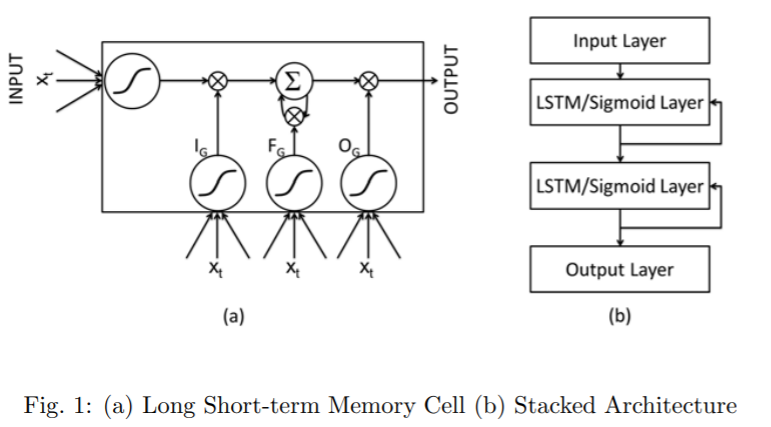

# Long Short Term Memory Networks for Anomaly Detection in Time Series
- Author: Pankaj Malhotra, Lovekesh Vig, Gautam Shroff, Puneet Agarwal
- Abstract
  - LSTM은 long term memory를 유지하는 능력 때문에 시퀀스 데이터에서 장기간의 패턴을 파악하기에 유용한 것으로 알려져 있음
  - 이 논문에서는 stacked LSTM을 통해 타임시리즈에서 anomaly/fault를 탐지하는 작업을 진행
  - 결과 예측 오류는 이상 행위의 가능성을 평가하는 데 사용되는 multivariate gaussian distribution으로 모델링 됨

## 1. Introduction

```
LSTM: RNN에서 발생하는 vanishing gradient 문제를 메모리 셀을 통해 error flow를 강제하는 곱셈 게이트를 사용함으로써 해결함 
  - Input gate, Output gate, Forget gate는 관련 없는 input, output의 영향을 줄여 장기 메모리를 저장
  - 장기 상관 관계를 학습하는 능력 때문에 LSTM은 미리 지정된 time window없이 복잡한 다변수 시퀀스를 모델링 할 수 있음

```
이 논문에서는 stack LSTM을 사용하여 시계열의 정상 동작을 모델링하고 미리 지정된 window나 전처리 없이도 정상적인 동작과의 편차를 정확하게 감지할 수 있음을 보임
  - Sigmoid 함수를 사용하여 순환 hidden layer를 stack하면 시계열 구조를 더 자연스럽게 포착하고 다른 시간 척도에서 시계열을 처리할 수 있음

시간적 이상 탐지 접근 방식은 시계열을 예측하고 예측 오차를 사용하여 감지하는 방법을 학습하나 LSTM의 경우 시계열을 예측하고 이상탐지를 하는 반복전인 계층적 처리 계층과 결합되지 않음? 따라서 우선 정상적인 행동을 모델링한 후 예측 오류를 사용하여 비정상적인 행동을 식별함

## 2. LSTM-AD: LSTM-based Anomaly Detection
```
$X = {x^{(1)}, x^{(2)}, ..., x^{(n)}}, where x^{(t)} \in R^m$인 timeseries를 고려,
 - 각 $x^{(t)}$는 m-dim으로 이루어진 time series
 - prediction 모델은 d개의 input 변수로 다음 l value를 예측하는 법을 학습함
```
```
normal sequence(s)를 다음과 같이 나눔
 - normal train($s_N$)
 - normal validation-1($v_{N1}$)
 - normal validation-2($v_{N2}$)
 - normal test($t_N$)

anomalous sequence(s)를 다음과 같이 나눔
 - anomalous validation(v_A)
 - anomalous test(t_A)
```
이상 탐지 순서는 stacked LSTM을 학습시킨 후 prediction error distribution을 계산하여 anomalies를  탐지하는 데 사용함

### Stacked LSTM based prediction model
각 m차원에 대해 입력 레이어에서 하나의 단위, 출력 레이어에서 dxl 단위를 취하여 각 d차원에 대한 각각의 l 미래 예측에 대해 하나의 단위를 가짐

Hidden 레이어의 LSTM 단위는 순환 연결을 통해 fully connected됨
feedforward connection을 통해 LSTM Hidden 레이어의 각 단위에서 그 다음 LSTM Hidden 레이어의 각 단위로 fully connected

$S_N$을 통해 학습을 하고, $v_{N1}$을 통해 early stop

### Anomaly detection using the prediction error distribution
예측 길이가 l이면  $l \leq t \leq n-l$에 대해 $x^{(t)} \in X$의 선택된 d차원 각각에 대해 l번 예측을 진행
```
$x^{(t)}$에 대해 error vector $e^{(t)}$를 계산
- $e^{(t)} = [e_{11}^{(t)}, ..., e_{1l}^{(t)}, ..., e_{d1}^{(t)}, ..., e_{dl}^{(t)}]$
  - $e_{ij}^{(t)}$는 $x_i^{(t)}$와 t-j 시점에서 예측된 값의 차이
```

$s_N$으로 train된 모델은 validation, test set의 error vector를 계산하는 데 사용하고, error vector는 다변수 정규 분포를 fit하는 데 모델링 됨
```
$\mathcal{N} = \mathcal{N}(\mu, \sumation)$
  - $v_{N1}$으로부터 계산된 error vector를 통해 $\mu, \sumation$을 추정
```
만약 $p^{(t)} < \tau$라면 $x^{(t)}$는 'anomalous'로 분류됨
  - $v_{N2}, v_A$는 $F_{\beta score}$를 최대화하면서 $\tau$를 학습하는 데 사용
  - anomalious: positive
  - normal: negative

### 4. Discussion
stacked LSTM net이 패턴 지속 시간에 대한 사전 지식 없이 더 높은 수준의 시간 패턴을 학습할 수 있고 따라서 정상적인 시계열 동작을 모델링 하여 이상을 탐지할 수 있음을 보임
LSTM-AD 접근 방식은 단기 및 장기 시간 종속성을 모델링하는 4개의 실제 데이터 세트에서 유망한 결과를 산출
RNN-AD와 비교하여 더 좋거나 유사한 결과를 제공하여 RNN 기반 모델에 비해 더 강력할 수 있음을 보이고, 특히 정상적인 동작이 장기 종속성을 포함하는 지 여부를 미리 알 수 없는 경우에 더 강력함
